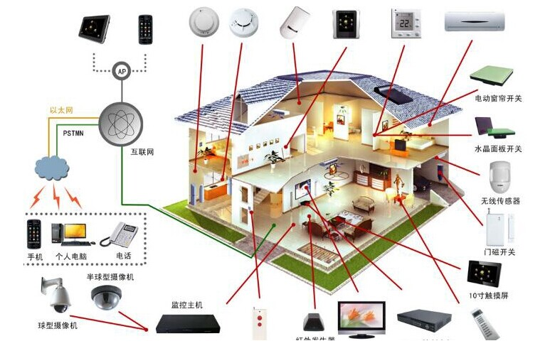

## Project Title.

#### スマートホームに関する研究

## Elevator Pitch.
スマートホームシステムは、ユーザーに新たな、高貴な、知的なデジタル化なリビングスペースをもたらす、新しい、高貴な、インテリジェントな人生体験を提供する。
## Description

スマートホームは、インターネットの影響で、物事化である。スマートホームは物事のインターネットで家庭の様々なデバイス（例えば、オーディオとビデオ機器、照明システム、カーテン制御、空調制御、セキュリティシステム、デジタル・シアター・システム、ビデオ・サーバ、ビデオ・キャビネットシステム、ネットワーク機器など）をネットワーク技術により、スマートホーム一緒に接続され、家電制御、照明制御、電話、リモコン、屋内と屋外のリモートコントロール、盗難警報、環境モニタリング、HVACコントロール、赤外線リピーターとプログラマブル・タイマ手段と制御などの機能をを提供するために一緒に接続されています。普通の家と比較して、スマートホームはただの伝統的な住宅はなくて、建物、ネットワーク通信、情報機器、設備の自動化の両方を備え、総合的な情報交換機能を提供し、さらにはエネルギーコストとお金の節約ができる。

## Download and Test.

## Technical Description.

## Appendix.
