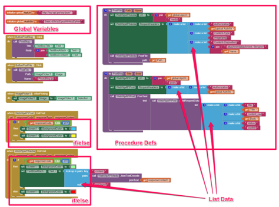

## Project Title.

#### スマートホームに関する研究

## Elevator Pitch.
スマートホームシステムは、ユーザーに新たな、気高い、知的なデジタル化なリビングスペースをもたらす、新しい、気高い、インテリジェントな人生体験を提供する。
## Description

スマートホームは、インターネットの影響で、物事化である。本研究はスマートホームの家電製御、照明制御、盗難警報を例として、スマートホームの一方を表す。普通の家と比較して、スマートホームはただの伝統的な住宅はなくて、建物、ネットワーク通信、情報機器、設備の自動化の両方を備え、総合的な情報交換機能を提供し、さらにはエネルギーコストとお金の節約ができる。

## Download and Test.
このアプリは WordPress REST API使うため, 全ての機能をテストするには、WordPressにREST APIを入れる必要. こちらのテストサイトを自由に利用しても構わない. アプリをダウンロードするには、MIT AI2 Companionアプリまたはスキャナーアプリを使っでQRコードをスキャンして、 または このダウンロードリンクをクリックする.

## Technical Description.
下記の画面コピーにあるように、このアプリはプロジェクトの最低限仕様を満たした。中に 2 個グローバル変数（global variables）, 4 個リストデータ（list data）, 2個関数（procedures or functions）, そして 2 個if/else 構造（structure）が含まれた。

## Appendix.
WP REST APIはWordPressのプラグイン、 将来は WordPressコアに組み入れ、WordPressを ブログプラットフォーム/CMS から、本格的なアプリケーション・フレームワークへ変身するために一歩である。

WP REST API は OAuth 1.0a とBasic Auth 認証方法サポートする。 しかしApp InventorはOAuth 1.0a対応できないため, Basic Authを利用した。Basic Auth はbase64 encodeを利用するが、それもApp Inventorだけでは計算できない, だからこのアプリは、グローバル変数（global variable）に 予めbase64 encode計算した値を入れる。
